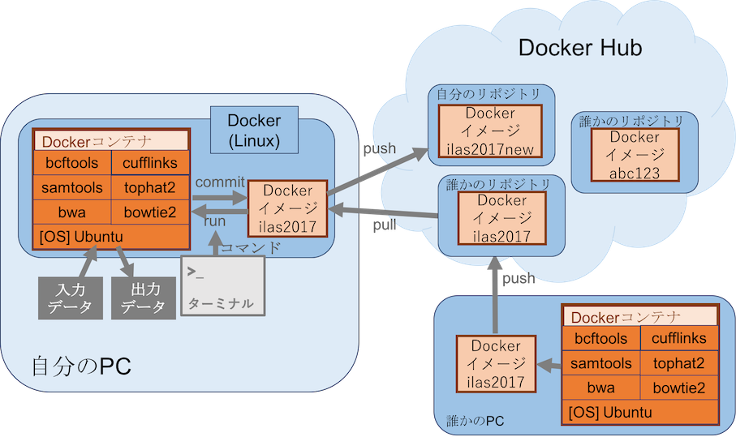

# Dockerコマンド

## 1. Dockerコンテナ・Dockerイメージ・Docker Hub

### Dockerコンテナ
　Dockerはコンテナと呼ばれるもので、「作成・削除したファイル・ディレクトリ」や「インストールしたソフトウェア」、「ソフトウェア間の関係」などの情報を保存している。

### Dockerイメージ
　Dockerイメージは、Dockerコンテナをまとめて配布・再利用できる形にしたもの。

### Docker Hub
　Docker HubはDockerイメージを保存・配布しているインターネット上のサービスのこと。作成した環境（Dockerイメージ）は誰でも無料でDocker Hubに置くことができ（有料サービスもある）、他者（または自身）が作成した環境を自身のパソコンの仮想PCにダウンロードすることもできる。

__ILASセミナーでは、バイオインフォマティクス関連のソフトウェア一式を準備した環境（Dockerイメージ）を利用します。そのイメージは、`qqep685d/ilas2017`という名前でDocker Hubに置いています。__

## 2. Dockerコマンド
　ターミナル（Docker Toolboxの場合、Docker Quick Terminal; Docker for Macの場合、通常のターミナル）を使い、Dockerの操作をおこないます。操作には適切な命令文（コマンド）が必要です。

### Dockerイメージの探す・取得・確認・削除

|動作|コマンド|例|備考|
|:-|:-|:-|:-|
|Docker Hubにあるイメージを探す|docker search|docker search ilas2017|-|
|Docker Hubからイメージを取得する|docker pull|docker pull qqep685d/ilas2017|-|
|パソコン内のDockerfileからイメージを取得する|docker build|docker build -t .|Dockerfileがあるディレクトリで実行するのが確実|
|取得したイメージを確認する|docker images|docker images|-|
|イメージを削除する|docker rmi|docker rmi qqep685d/ilas2017|-|

### Dockerコンテナを起動・ログイン・停止・確認・削除

|動作|コマンド|例|備考|
|:-|:-|:-|:-|
|イメージからコンテナを作成し、起動する|docker run|docker run --rm -v ${PWD}:${PWD} -i -t qqep685d/ilas2017 bash|-i -t: インタラクティブモードで起動（コンテナ内のシェルに入る）。-itと短縮可能。  --rm: コンテナ終了時に履歴を残さない。  -v: ホストPCの任意ディレクトリとコンテナ内のディレクトリを接続する。[使い方]-v /ホストディレクトリ/:/コンテナディレクトリ/）|
|コンテナを確認する|docker ps|docker ps -a|コンテナIDを確認することができる。  -a: 停止中のコンテナを含めて表示する。-aがない場合、起動中のコンテナのみ表示。|
|停止中のコンテナを起動（再開）させる|docker start|docker start [コンテナID]|-|
|起動中のコンテナにログインする|docker attach|docker attach [コンテナID]|-|
|起動中のコンテナを停止させる|docker stop|docker stop [コンテナID]|-|
|コンテナを削除する|docker rm|docker rm [コンテナID]|-|

__すべてのコンテナ履歴を削除したい場合は次の2コマンドを実行する__  
`docker stop $(docker ps -a -q)`  
`docker rm $(docker ps -a -q)`

### ファイルをコピーする

|動作|コマンド|例|備考|
|:-|:-|:-|:-|
|起動時にコンテナと自身のPCのディレクトリをつなぐ|docker run -v|docker run -it -v ${PWD}:${PWD} qqep685d/ilas2017|runコマンドの-vオプションを使用|
|コンテナから自身のPCへのファイルコピー|docker cp|docker cp [コンテナID]:/home/guest.txt $PWD|-|
|自身のPCからコンテナへのファイルコピー|docker cp|docker cp host.txt [コンテナID]:/home/|-|

### Dockerコンテナについて注意点
- `docker run`は初期状態のコンテナが起動する。そのコンテナには毎回異なるIDが付与される。コンテナ内の作業はIDに紐付けされており、その作業はコンテナからログアウト後も一時保存された状態で残される。  

- `docker ps -a`でコンテナの履歴を確認できる。

- 履歴のコンテナに再度ログインするには、`docker start [コンテナID]`（コンテナを起動）と`docker attach [コンテナID]`（コンテナにログイン）が必要。

- 不要になったコンテナ履歴は、`docker rm [コンテナID]`で削除が可能。

---

# ILASセミナー2017 目次
## テキスト
- [Docker入門](./00_Starting_Docker.md)
- [Dockerコマンド](./01_Docker_Commands.md)
- [Perlプログラミング基礎](./02_Intro_Perl.md)
- [Pythonプログラミング on Jupyter Notebook (Windows版)](./03_1_Python_on_Jupyter_for_Windows.md)
- [Pythonプログラミング on Jupyter Notebook (Mac版)](./03_2_Python_on_Jupyter_for_Mac.md)
- [RNA-seq解析入門](./04_RNA-seq_analysis.md)

## 補足
- [なぜ仮想PCを構築するのか？](./XX_Why_use_docker.md)
- [（自習用メモ）解析環境の立ち上げ方法](./YY_Memo_for_self-training.md)
