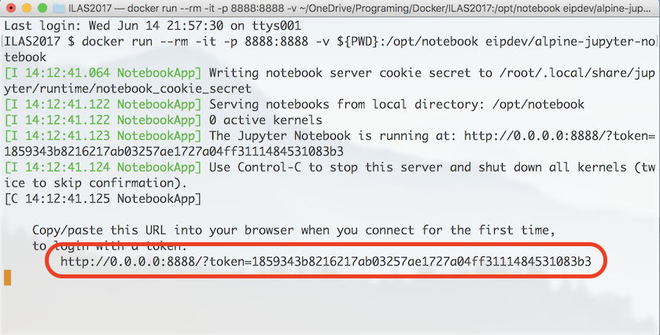

# Pythonプログラミング on Jupyter Notebook (Mac版)

## 1. 事前準備
1. デスクトップに新しいフォルダ（ディレクトリ）を作成する。  
（デスクトップ上に「ILAS」というディレクトリを作成したとする）
1. ターミナルを開く。
1. 上で作成したディレクトリに移動する。`cd Desktop/ILAS/`

### (1) Dockerイメージのダウンロード
`docker pull eipdev/alpine-jupyter-notebook`

### (2) 実行
`docker run --rm -it -p 8888:8888 -v ${PWD}:/opt/notebook eipdev/alpine-jupyter-notebook`

### (3) Webブラウザ (Safariなど)を開く

### (4) Jupyter Notebookを開く
　ターミナルに表示されているアドレス`http://0.0.0.0:8888/?token=<文字列>`を、アドレスバーにコピー＆ペーストする。  

　または、  

　アドレスバーに`localhost:8888`を入力し、エンターキーを押す。  
　ノートブックが開いたあと、パスワードの入力を求められる。その際、ターミナルに表示されているtoken=`<文字列>`をコピー＆ペーストする。



---

## 2. プログラミング演習

　以降は、Jupyter Notebook上でプログラミング演習を行う。  
　作成したファイルはデスクトップの「ILASフォルダ」に保存されます。

### ノートブックの操作方法
1. 右上のあたりにある「New」をクリック。
2. Python 3 を選択する。
3. 新しいタブにノートブックが表示されるので、そこにPythonコードを書き込んでいく。
4. コードを実行する際は、`Control + Enter`。  
または、`Shift + Enter`（実行と同時に次のブロックに移動する）

```Python
# サンプルコード

import numpy as np              # ランダムな数値を発生させるために必要なライブラリ
import matplotlib.pyplot as plt # 図描画に必要なライブラリ

# maplotlibで作成した図をノートブックに表示するのに必要
%matplotlib inline

x = np.random.rand(10)          # ランダムに10個の数値を作成し、変数xに代入
print('x-values: ', x)          # xに入っている数値を表示する
y = np.random.rand(10)          # ランダムに10個の数値を作成し、変数yに代入
print('y-values: ', y)          # yに入っている数値を表示する

plt.scatter(x,y)                # 散布図に表示する。

# 各点の座標は、(変数xの数値, 変数yの数値)である。
# 例えば、変数x=[0.200, 0.321...], 変数y=[0.300, 0.123...]の場合、1番目の点は(0.200, 0.300), 2番目の点は(0.321, 0.123)である。
```

### Jupyter Notebookを終える際の操作
1. Webブラウザのノートブックを閉じる。
2. ターミナルに戻り、`Control + C`を押す。
3. 閉じるかどうか問われるので、「y」を 入力し、エンターキーを押す。


---

# ILASセミナー2017 目次
## テキスト
- [Docker入門](./00_Starting_Docker.md)
- [Dockerコマンド](./01_Docker_Commands.md)
- [Perlプログラミング基礎](./02_Intro_Perl.md)
- [Pythonプログラミング on Jupyter Notebook (Windows版)](./03_1_Python_on_Jupyter_for_Windows.md)
- [Pythonプログラミング on Jupyter Notebook (Mac版)](./03_2_Python_on_Jupyter_for_Mac.md)

## 補足
- [なぜ仮想PCを構築するのか？](XX_Why_use_docker.md)
